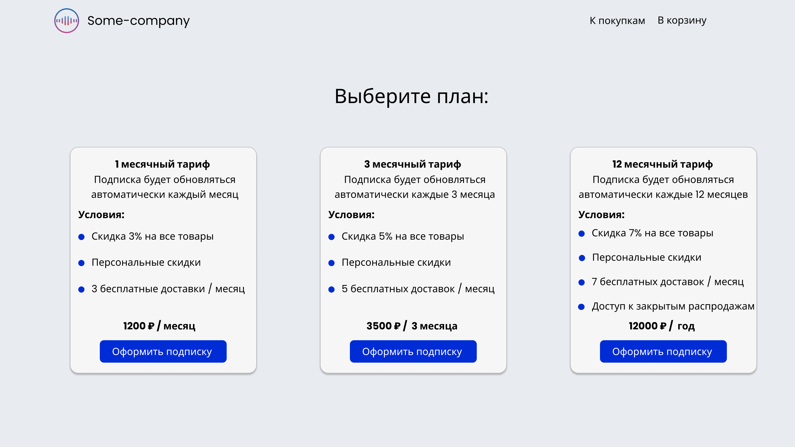

# 202206-ok-subscription-service
Сервис управления подписками. Позволяет создавать новые виды подписок и редактировать уже существующие для администраторов. 
Предоставляет возможность выбора и оформления (оплата через yokassa.ru) представленных подписок клиентам сервиса. 

## Маркетинг приложения
Считаю, что аудитория данного сервиса - небольшие бизнесы с собственным сайтом, которые могут подключить данный функционал в качестве модуля. 
В теории данный функционал можно сделать полностью модульным и использовать в маркетплейсе модулей, либо модулем для конструкторов сайтов (tilda, wix и т.п.)

### Гипотетический портрет пользователя, использующего сервис
1. Молодой предприниматель, реализующий бизнес с подписочной системой
2. Владелец небольшого бизнеса, не готовый тратить лишние деньги для того, чтобы разработчики сделали функционал, который можно приобрести в качестве модуля.
3. Как правило разбирается в современных тенденциях потребительского рынка и рынка технологий

### Описание MVP *(Информация может меняться, т.к. продукт находится на начальных этапах разработки)*

Админка:
служебное api для заведения/редактирования сущности “подписка”
механизм проверки активности подписки
Клиентская часть:
формирование сущности “платеж”
механизм оплаты (интеграция yookassa.ru)
асинхронная проверка статуса платежа
UI для выбора подписки и произведения оплаты (представлена ниже)

### Функции (эндпоинты)
1. CRUDS (create, read, update, deelete, search) для подписок (subscription)
2. Эндпоинт для оформления подписки
